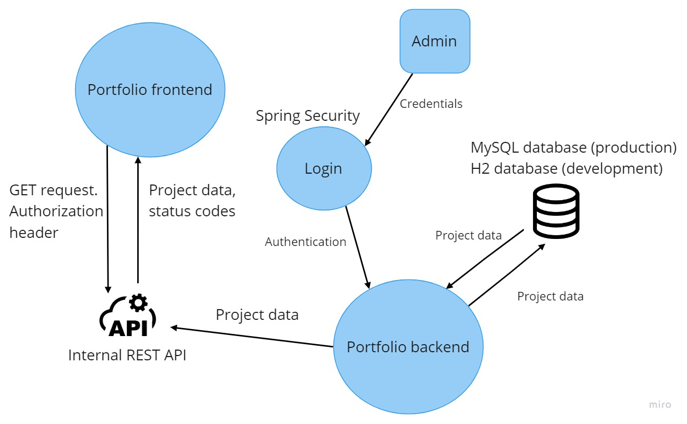
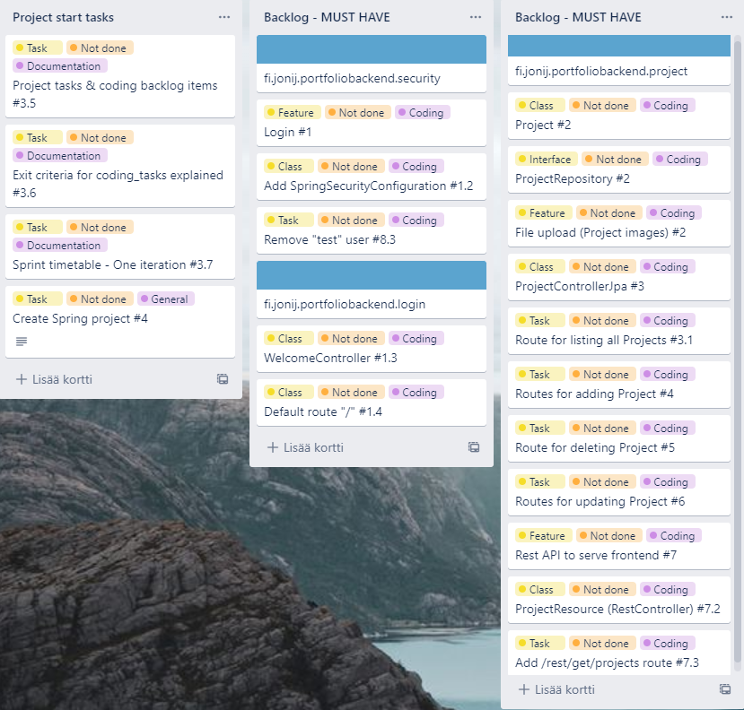
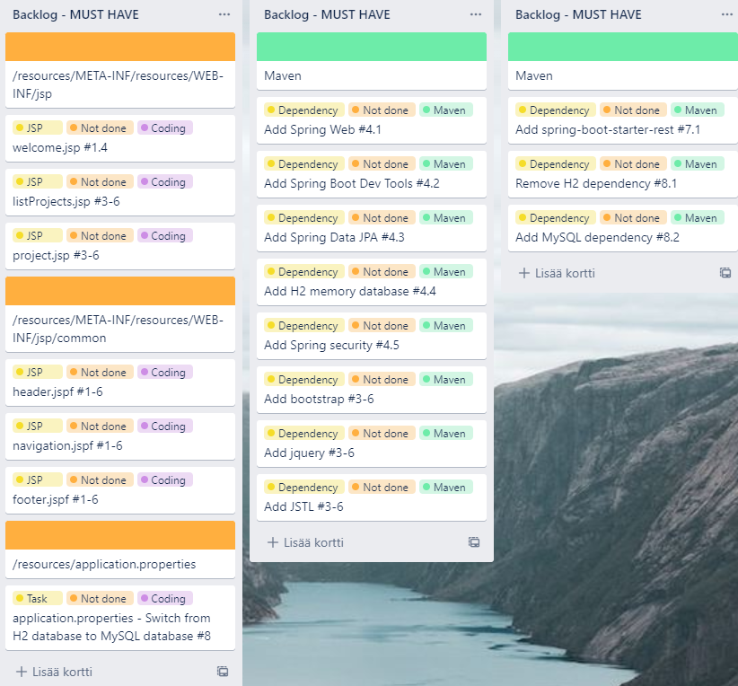
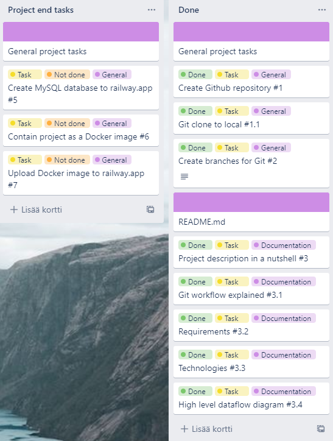
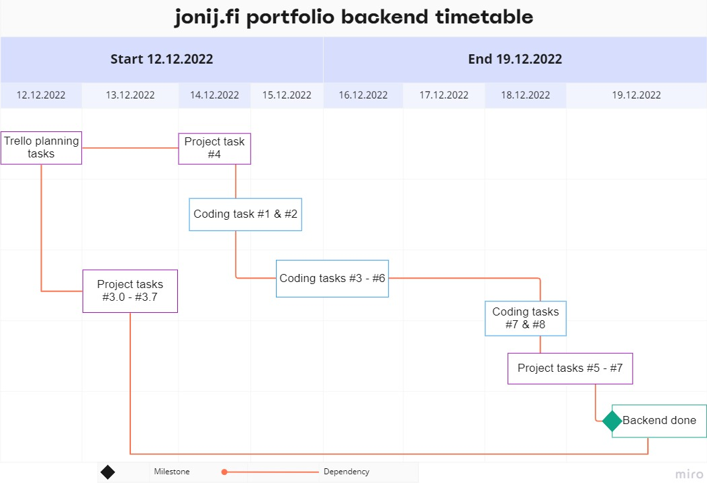

# Portfolio backend (jonij.fi)
## Project description in a nutshell

This is the backend of a fullstack project, which is a portfolio for showcasing my past projects.

Frontend shall be done after the backend is ready.

## Git workflow

### The project has five different kinds of branches:
- **main (production)**
  - This is only touched when release is ready to be merged to the main.
  
  
- **release**
  - Unit tests are  not included in the release branch.
  - H2 database is switched to MySQL database.
  - Last check that everything is as it should for production phase.
  
  
- **development**
  - When development is ready, it is then merged to the release branch.
  
  
- **project_task_3, 4, 5...**
  - When project_task is complete, it is then merged to the development branch.
  
  
- **coding_task_1, 2, 3...**
  - When coding_task passes the exit criteria, it is then merged to the development branch.
  - Exit criteria is explained later in the documentation.
  
  
- **hotfix_1, 2, 3...**
  - Changes that are not planned but must be done are handled in hot_fix branches.
  - Merging to development when hot_fix is done.
  

## Requirements

- **Login page for admin**
  - If login successful &rarr; Land to Welcome -page
  - If not &rarr; Message: "Invalid credentials"

- **Admin can logout**
  - Admin redirected to frontend

- **All relevant information stored about Projects**
  - **id** (int), Primary key, required
  - **username** (String), required
  - **projectName** (String), required
  - **projectType** (String), required
  - **dateOfCompletion** (LocalDate), required
  - **isDeployed** (boolean), required
  - **sourceCodeURL** (String)
  - **projectURL** (String)
  - **projectImageFilename** (String)

- **Admin can interact with project database (MySQL) using graphical UI** 
  - **Create project**
    - id is set automatically
    - Project image can be uploaded, projectImageFilename set in process
    - All the rest Project fields can be set
  - **Read project**
    - Projects -page listing all projects
  - **Update project**
    - Update by id
    - New project image can be uploaded, projectImageFilename set in process
    - All the rest Project fields can be updated
  - **Delete project**
    - Delete by id

- **Frontend can access Projects data via Internal REST API**
  - **/rest/get/projects** -route returns all projects in JSON

## Technologies

### Spring Boot
- **Spring Security** - Login functionality and authentication
- **Spring Web** - For building webapp
- **Spring Boot starter test** - JUnit, Mockito etc. for writing  tests
- **Spring Data JPA** - Easy database interactions
- **H2** - Memory database for development purposes
- **Spring Boot Rest** - REST API
- **MySQL drivers** - Production database
- **Bootstrap** - CSS Framework for styling
- **jQuery** - JavaScript library for functionalities like calendar picker
- **JSTL** - JSP Standard Tag Library for working with JSPs

## Dataflow

## General project & coding -tasks

These are the project tasks, classes and features that I came up when planning this project. 

### Trello

## Exit criteria for coding tasks

- Task must reach its goal before testing
- If applicable, unit tests must be done for all methods linked to the task
- Also Negative scenarios must be tested if applicable
- All tests must pass
- Code must be refactored

## Project timetable

